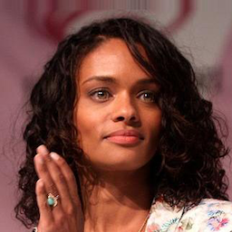
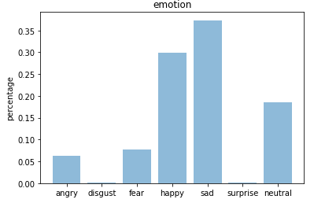
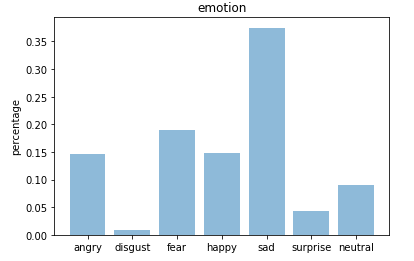
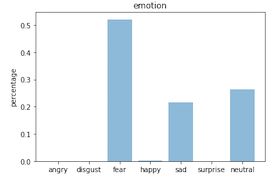
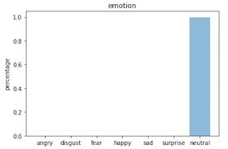

# Human Facial Emotion Detection
### [TODO: NEEDS EMOTIONAL FACE COLLAGE HEADER IMG]

### Daniel Kim

## Overview
Human emotion detection is a downstream task of Computer Vision. Classification of human emotions remains a difficult endeavor for ML and CV practitioners despite major advances in both network architectures and algorithms. Just a few years ago, SOTA scores hovered around the 0.37 accuracy mark.  

For good reason, human emotion detection still is considered a nascent practice. In part because human emotions are so complex, but perhaps even more the relationships and correlations between or among emotional variables are expected to overlap in a fluent way rather than a strict classification. Yet, this early research is crucial as algorithms improve and the use cases in real-life situations hold increasingly high stakes: potential problems range from police interrogation to leverage suspects' emotional states to misguided psychiatric evaluation to social abuses of dating practices and real-time emotion monitoring about how one might feel about another (e.g., a first date).  

## Purpose
This project attempts to build upon past work to achieve higher marks in accuracy using a keras CNN implementation. The task is to accurately classify seven different emotions from the given images: Angry, Sad, Happy, Fear, Disgust, Surprise, and Neutral.

## Data
I utilized the [FER dataset](https://arxiv.org/abs/1307.0414) featured in "Challenges in Representation Learning: A report on three machine learning contests," authored by well-known GAN innovator, Ian Goodfellow. The dataset features actors in various states of facial expression which are to be classified into the categories denoted above.

The data was divided into train/test sets of 28709 and 3589 expressions, respectively.  

## Analysis and Results

> Kandyse McClure, better known as "Dee" in the remake of Battlestar Galactica  

I should note I avoided using hyperbolic examples of emotion and instead opted for what are--to my human eyes, anyway--examples of complex emotion. The algorithm did quite well in extreme cases, e.g., correctly classifying what appears to be an overjoyed baby. The "neutral" category, however, was the most confounding to the testing, and in some ways I wished the annotators did not have that option to avoid confusion (more on this below).

My best results achieved an accuracy of 0.58 which is quite an improvement over scores from when the dataset was initially released--although I concede I was hoping for a better improvement, overall. Training was conducted between a range of 5 epochs to 100 epochs and at a wide latitude of batch sizes. Despite the vast difference in the length of training runs, results did not vary much: at most, a 0.07 difference was observed based on the number of epochs.

 
> Kate Winslet shoots an ambiguous expression across the car  

Overfitting was a major problem. Typically, in multi-class categorizations, annotators are given permission to tag more than one category which in turn creates multicollinearity in the data. For example, it's possible for an expression to be considered as Neutral, Angry, and Sad (to be fair, at differing probabilities).  

Given the rationale offered for overfitting is a homoscedastistic one, another problem arises that is more difficult to pin down. For example, despite the number of iterations, the accuracy on the val set tends to stay within a 0.7 margin. Even so, slight alterations in the number of training iterations can yield dramatically different results despite the stable and consistent val scores. Here, two plots of the same photo of Ted Danson demonstrate this anomaly:

  
> An example of two disparate evaluations despite very similar scores in the val set  

After fine-tuning hyperparameters, I was able to fit training data much more closely to validation sets and reduce overfitting. 15 epochs seemed to be the sweet spot for running inference. In addition, I introduced another round of layers (dropout, dense) and changed batch sizes in a range between 128-1024. This tuning greatly improved performance.

## Conclusion
Given the real-life ambiguities of human emotions, it's more than understandable that classes would not have sharp definition into one category but rather bleed into one another. This problem is the single biggest hurdle of emotion classification: it depends upon annotators' judgements related to distinctions of emotions that perhaps are not always meant to be distinguished.  

More work can be done to make both annotation and practitioner analysis more sophisticated. For example, a time-series analysis could turn the classification categories into a distribution of semantic similarities based in time-space rather than more stagnant, 'snapshot'-based classification. In fact, attempts at that work is already beginning with real-time, video and web-cam based classifications, although those analyses also return to the single-image classification metric with the primary difference being one is a moving set of images while the other is not. Perhaps, when time is considered the crucial distribution first, better signal can be captured as emotion classification begins to articulate with time-series distributions.  

In retrospect, and for future analyses, I believe this task would have better been served by an unsupervised model. For example, clustering similar emotions could scale back the distinctive edges of classification into a more realistic blend where happy and sad need not compete against one another. Feature extractions would be fine-grained into difficult-to-classify categories, as perhaps they should be when addressing something so amorphous as emotion. From that point, a savvy combination of feature engineering and classification could bring emotion into a much more readable territory.  
